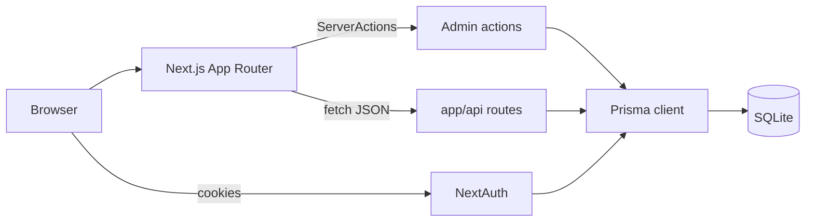
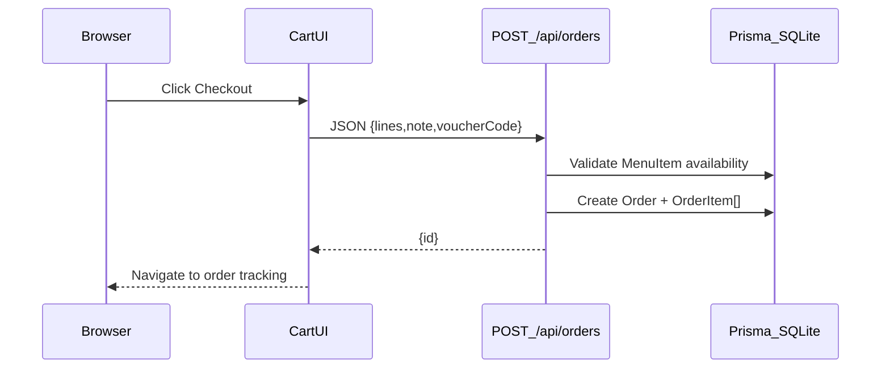
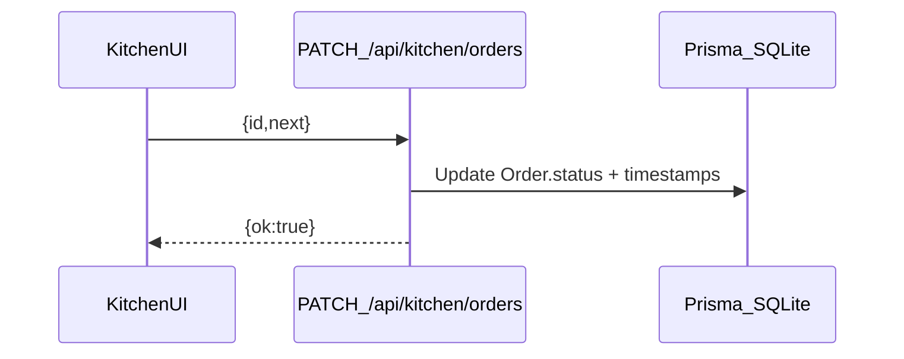
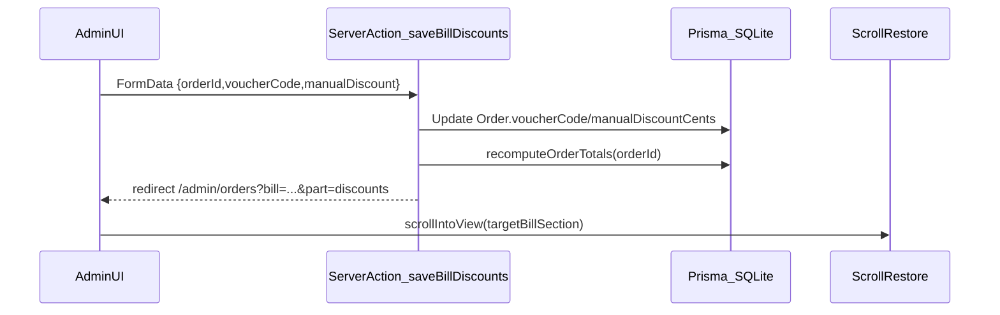

# System Explanation — Backend + Frontend (Menu MC)

This document explains the full system: **database**, **authentication/roles**, **backend APIs/server actions**, and how the **frontend** uses them end-to-end.

## High-level architecture

Menu MC is a single Next.js application that contains:

- **Frontend**: React UI via the App Router (`app/**`)
- **Backend**:
  - **Route handlers** in `app/api/**` (JSON endpoints)
  - **Server Actions** (form actions) for admin workflows
- **Database**: SQLite via Prisma
- **Auth**: NextAuth (credentials) + role gating



## Database model (Prisma)

Schema: `prisma/schema.prisma`

Core entities:

- **User**: credentials + `role` (`ADMIN`, `KITCHEN`, `WAITER`, `TABLE`), optional `tableId`
- **Table**: physical table identity (label)
- **Category** / **MenuItem**: menu structure, availability flags, optional prep time
- **Order**:
  - status lifecycle: `NEW → IN_PROGRESS → READY → COMPLETED` (or `CANCELLED`)
  - money fields (cents): `totalCents`, `voucherDiscountCents`, `manualDiscountCents`, `finalTotalCents`
  - optional override: `finalTotalOverrideCents` (if set, becomes the charged total)
  - payment fields: `isPaid`, `paidAt`
- **OrderItem**:
  - line snapshot: `name`, `price` (string), `quantity`
  - optional `menuItemId` (link back to `MenuItem` when the line originated from the menu)
- **Voucher**: code-based discounts (amount/percent) with validation + usage counting

## Authentication + authorization

Auth config: `lib/auth.ts`

- Credentials provider validates email/password (bcrypt).
- JWT session strategy; session is enriched with:
  - `userId`, `role`, `tableId`

Auth route handler:

- `app/api/auth/[...nextauth]/route.ts`

Role-based gating:

- `middleware.ts` restricts:
  - `/admin/**` → `ADMIN`
  - `/kitchen/**` → `KITCHEN` or `ADMIN`
  - `/waiter/**` → `WAITER` or `ADMIN`

## Money + discounts rules

Helpers:

- `lib/money.ts`: `parsePriceToCents`, `formatCentsUSD`, `formatCentsAsDollarInput`

Discount rules:

- `lib/discounts.ts`:
  - voucher discounts are computed from the current subtotal
  - manual discount is clamped to never exceed the remaining amount after voucher

Bill recomputation:

- `app/admin/orders/actions.ts` → `recomputeOrderTotals(orderId)`:
  - recalculates `totalCents` from `OrderItem[]`
  - recomputes voucher discount from `voucherCode`
  - clamps manual discount
  - sets `finalTotalCents` to:
    - `finalTotalOverrideCents` if present, otherwise
    - `totalCents - voucherDiscountCents - manualDiscountCents` (min 0)

Important behavior:

- **Discounts and final override are independent**:
  - saving discounts does **not** change the override
  - saving the final override does **not** change discounts

## Backend surface area

## Validation and error handling (backend)

The backend uses **Zod** for request validation on JSON APIs (route handlers) and some server actions.

Where validation happens:

- `app/api/orders/route.ts`: validates table checkout payload (`note`, `voucherCode`, `lines[]`).
- `app/api/kitchen/orders/route.ts`: validates kitchen status patch (`id`, `next`).
- `app/api/waiter/orders/route.ts`: validates waiter manual order payload.
- `app/api/table/order/route.ts`: relies primarily on session role checks + query constraints.
- `app/admin/orders/actions.ts`: uses Zod for line edits and order meta, and direct `FormData` parsing for discount/final saves.

Error response patterns:

- **401 Unauthorized**: not logged in / no session cookie.
- **403 Forbidden**: logged in but wrong role (e.g., non-table attempting checkout).
- **400 Bad Request**: payload validation failed or referenced IDs are invalid/unavailable.
- **500 Server error**: unexpected exception (commonly caused by schema mismatches if migrations weren’t run).

### Table checkout

- `POST app/api/orders/route.ts`
  - validates ordered menu item IDs are available (prevents spoofing)
  - creates `Order` and `OrderItem[]` lines (persists `menuItemId` on lines)
  - computes `totalCents`, optional voucher discount, and `finalTotalCents`

#### Request (JSON)

```json
{
  "note": "no onions",
  "voucherCode": "SAVE10",
  "lines": [
    { "menuItemId": "ck...", "name": "Burger", "price": "$9.99", "quantity": 2 }
  ]
}
```

Notes:

- `lines[].name` and `lines[].price` are accepted but **the server uses the current `MenuItem` record** for `name/price` when persisting, after validating availability.
- Voucher code is uppercased server-side.

#### Response (JSON)

Success:

```json
{ "id": "ck..." }
```

Errors:

- `401` `{ "error": "Unauthorized" }`
- `403` `{ "error": "Only tables can place orders" }`
- `400` `{ "error": "Invalid payload" }` / `{ "error": "One or more items are unavailable" }`
- `500` `{ "error": "Server error creating order. ..." }`

Edge cases and rules:

- **Price trust**: client-sent `lines[].price` is not trusted; server persists the current `MenuItem.price`.
- **Availability**: item must be `isAvailable=true` and `isOutOfStock=false` at order time.
- **Voucher usage**: voucher `usesCount` increment is best-effort; order creation does not fail if increment fails.
- **ETA**: `estimatedReadyAt` is computed as the sum of `prepTimeMinutes * quantity` for each menu item (best-effort).

### Kitchen orders API

- `GET app/api/kitchen/orders/route.ts`
  - returns recent orders (up to 50) with `table` + `items`

Response shape:

```json
{ "orders": [ { "id": "ck...", "status": "NEW", "table": { "label": "T1" }, "items": [] } ] }
```

- `PATCH app/api/kitchen/orders/route.ts`
  - request: `{ "id": "<orderId>", "next": "IN_PROGRESS" | "READY" | "COMPLETED" | "CANCELLED" | "NEW" }`
  - updates timestamps (`startedAt`, `readyAt`, `completedAt`) based on the transition
  - response: `{ "ok": true }`

Status codes:

- `401` plain text `"Unauthorized"` when missing session/role
- `400` plain text `"Invalid payload"` when Zod fails

Edge cases:

- Patch accepts any `next` enum value; the backend does not enforce a strict state machine (e.g. READY → NEW is technically possible if called).

### Waiter manual order API

- `POST app/api/waiter/orders/route.ts`
  - role: `WAITER` or `ADMIN`
  - creates an order for a specific `tableId`, with optional voucher + manual discount

Request (JSON):

```json
{
  "tableId": "ck...",
  "note": "",
  "voucherCode": "SAVE10",
  "manualDiscount": "5.25",
  "lines": [{ "menuItemId": "ck...", "quantity": 1 }]
}
```

Response:

```json
{ "id": "ck..." }
```

Status codes:

- `401` `{ "error": "Unauthorized" }`
- `403` `{ "error": "Forbidden" }`
- `400` `{ "error": "Invalid payload" }` / `{ "error": "Unknown table" }` / `{ "error": "One or more items are unavailable" }`

Edge cases:

- Manual discount is parsed as dollars and clamped so totals never go below zero.
- Voucher use increment is best-effort (same as table checkout).

### Table “active order” API

- `GET app/api/table/order/route.ts`
  - role: `TABLE`
  - returns the newest order for that table user in statuses `NEW|IN_PROGRESS|READY`

Response:

```json
{ "order": { "id": "ck...", "status": "IN_PROGRESS", "estimatedReadyAt": null, "items": [] } }
```

Status codes:

- `401` plain text `"Unauthorized"`
- `403` plain text `"Forbidden"`

Edge cases:

- Returns `{"order": null}` when the table has no active order in `NEW|IN_PROGRESS|READY`.

### Kitchen + waiter + table status

Routes live under:

- `app/api/kitchen/**`
- `app/api/waiter/**`
- `app/api/table/**`

They provide “device views” of orders and allow status transitions or payment changes (role-gated by middleware/session).

### Admin server actions (bills)

File: `app/admin/orders/actions.ts`

- **Order meta**: `updateOrder` (status/note/paid)
- **Discounts**: `saveBillDiscounts` (voucher + manual)
- **Final override**: `saveBillFinal` (custom charged total; clear to return to automatic)
- **Line edits**: `updateOrderLine`, `deleteOrderLine`, `addOrderLine`

Each action revalidates key pages and redirects back to the same bill section for UX.

Edge cases:

- **Recompute cost**: every line edit/add/delete triggers `recomputeOrderTotals(orderId)`, which reads all lines for the order and updates the order totals.
- **Override precedence**: if `finalTotalOverrideCents` is set, `finalTotalCents` follows it even if discounts change. Discounts are still stored for record-keeping.

## Performance and scaling notes

These are intentional small-scale limits appropriate for a small restaurant demo, and can be adjusted.

- **Kitchen list size**: kitchen GET returns up to `take: 50` orders.
- **Admin orders list size**: admin view loads up to `take: 100` orders (see `app/admin/orders/page.tsx`).
- **Polling**:
  - kitchen and table status screens typically poll periodically for updates (simple and reliable for a local network scenario).
  - for larger scale, consider server-sent events / websockets or a push notification mechanism.
- **Recompute totals**:
  - recompute reads all `OrderItem[]` for an order each time; this is fine for small tickets.
  - if orders can have many lines, consider incremental updates or DB-level computed sums.

#### Server actions reference (admin bills)

File: `app/admin/orders/actions.ts`

- `updateOrder(formData)`
  - input: `orderId`, optional `status`, optional `note`, optional `isPaid`
  - side effects: may set `startedAt/readyAt/completedAt` timestamps; sets `paidAt` when paid
  - redirect: `?bill=<id>&part=meta`

- `saveBillDiscounts(formData)`
  - input: `orderId`, `voucherCode`, `manualDiscount` (dollars string)
  - behavior: updates stored discount fields, then recomputes totals
  - does **not** modify `finalTotalOverrideCents`
  - redirect: `?bill=<id>&part=discounts`

- `saveBillFinal(formData)`
  - input: `orderId`, `finalPriceOverride` (dollars string, empty string clears)
  - behavior: sets/clears `finalTotalOverrideCents`, then recomputes totals
  - does **not** modify voucher/manual discount fields
  - redirect: `?bill=<id>&part=final`

- `updateOrderLine(formData)`
  - input: `orderId`, `itemId`, `name`, `price`, `quantity`
  - behavior: updates one line (scoped by `orderId + itemId`) then recomputes totals
  - redirect: `?bill=<id>&part=lines&row=<itemId>`

- `deleteOrderLine(formData)`
  - input: `orderId`, `itemId`
  - behavior: deletes one line (scoped by `orderId + itemId`) then recomputes totals
  - redirect: `?bill=<id>&part=lines`

- `addOrderLine(formData)`
  - input: `orderId`, `name`, `price`, `quantity`
  - behavior: creates an ad-hoc line (`menuItemId=null`) then recomputes totals
  - redirect: `?bill=<id>&part=add`

Redirect URL builder:

- `app/admin/orders/nav.ts` → `adminOrdersReturnUrl(orderId, part, { row? })`

## Frontend ↔ backend flows

### Flow 1: Place order (table)

1. Browse menu and build cart (client state).
2. Checkout calls `POST /api/orders`.
3. Frontend navigates to the order tracking page; polling shows status/ETA updates.



### Flow 2: Kitchen fulfillment

1. Kitchen screen polls kitchen orders API.
2. Staff advances status (NEW → IN_PROGRESS → READY → COMPLETED).
3. Table and waiter views reflect those changes via polling/revalidation.



### Flow 3: Admin bill editing

1. Admin opens `/admin/orders`.
2. Edits lines, adds/removes lines → totals are recomputed server-side.
3. Saves discounts and/or a custom final price (separately).
4. After saves, frontend scrolls back to the same bill section:
   - `app/admin/orders/AdminOrdersScrollRestore.tsx`
   - redirects are produced by `app/admin/orders/nav.ts`



